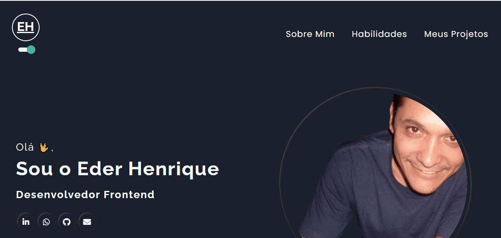

# Projeto Portifólio Pessoal

## Objetivo

- Construir um portifólio pessoal contendo uma seção sobre o autor, uma seção de habilidades do autor e uma seção de projetos do autor. Além do mais, o portifólio deverá possibilitar a mudança de tema dark/light. 

<br>

## Índice 📜

#### Screenshot

#### Como rodar o projeto

<br>

## Screenshot 🎬

<div align='center'>

</div>

<br>

## Tecnologias Usadas 🛠

- React;
- Styled Components;

<br>

## Como rodar o projeto 🎮

Clone o repositório
```bash
git clone https://github.com/ederhscc/portifolio-eder
```

 Acesse a pasta do projeto
```bash
cd portifolio-eder
```

Instalar as dependências
```bash
npm install
```

Execute a aplicação
```bash
npm start
```

<br>

## Autor 🧑

### Eder Henrique Santos

<br>

## Links 🔗

Deploy: 

<div align="left">

  <a href = "mailto:ederhscc@gmail.com" target="_blank">
  
  </a>
  </br>
  <a href="https://www.linkedin.com/in/eder-henrique-santos" target="_blank">
  
  </a>
  </br>

</div>